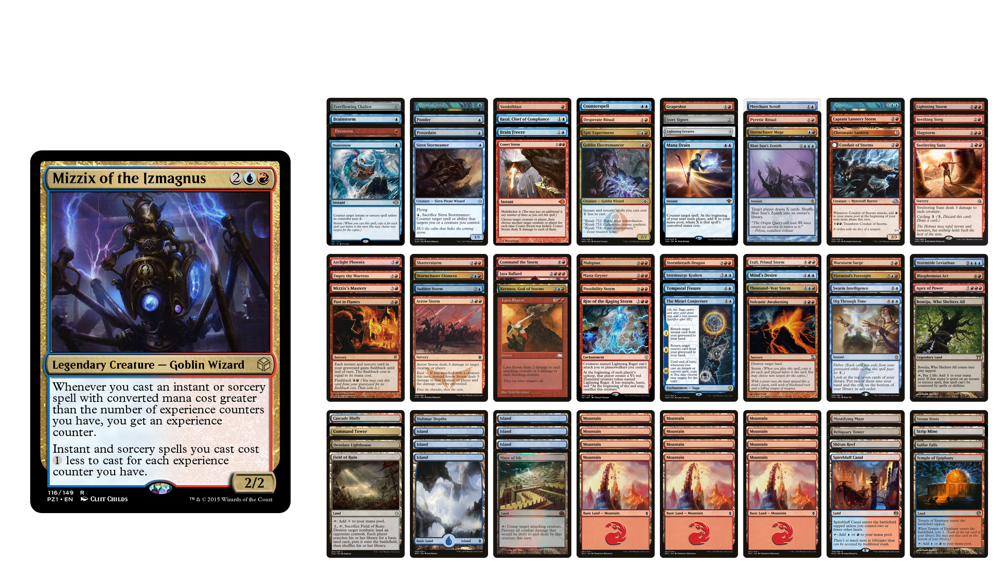
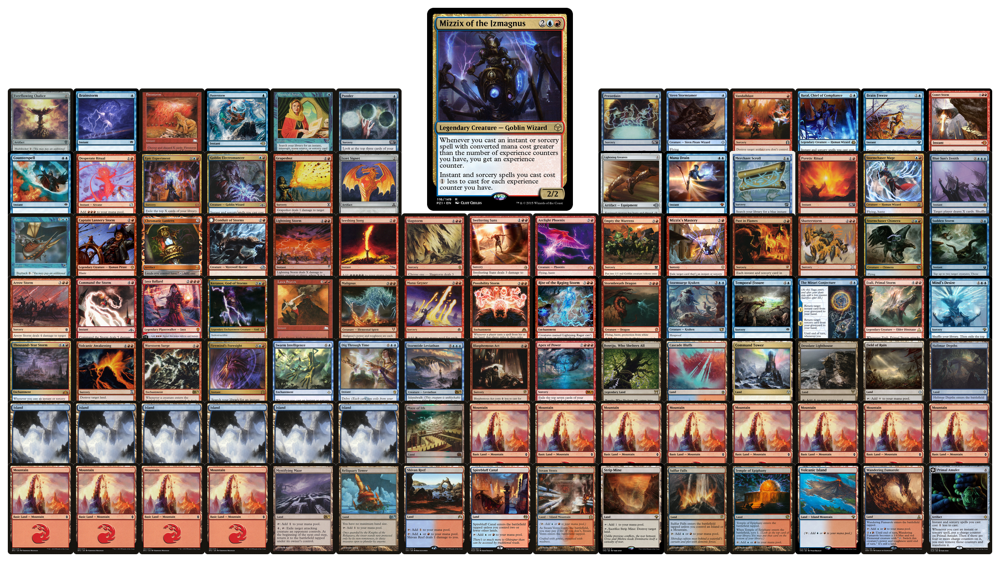
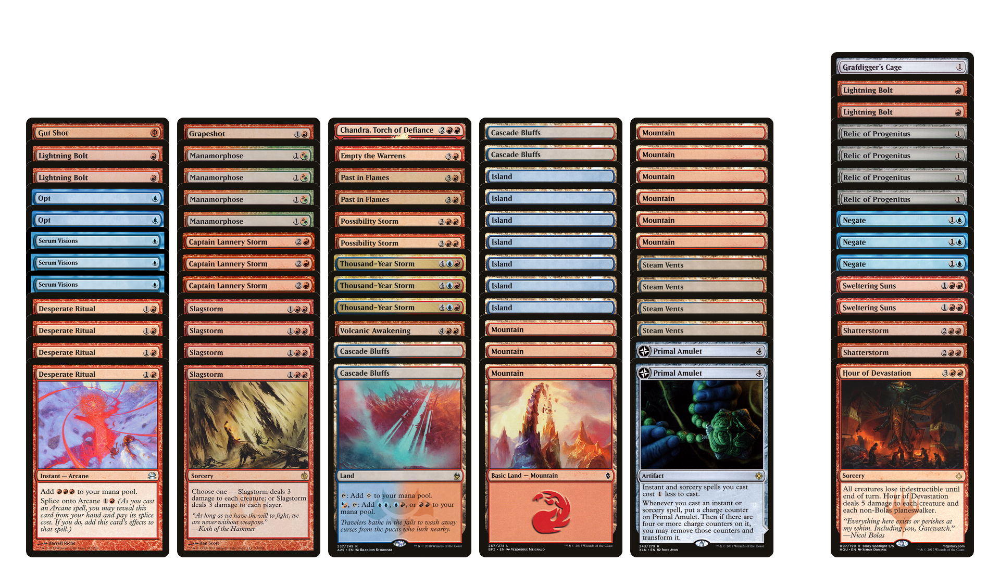
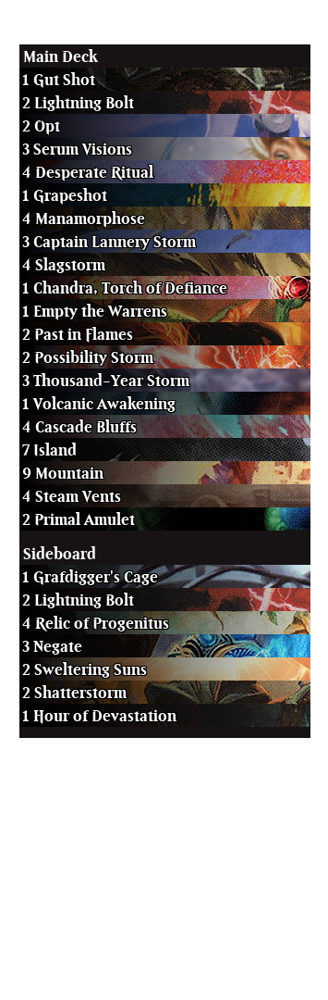
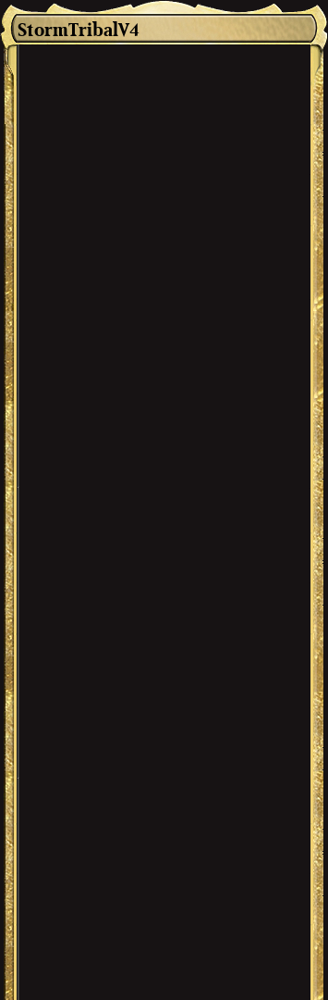

# mtgoverlay

Here's a bunch of scripts I used when I used to stream and make deck techs. They're very rough around the edges - I don't intend to make massive updates to them (though am happy to accept PRs).

All these tools work on top of MTGO .dek files.

## Commander Deck List

- Run this by doing `python cmdrdeckoverview.py <path to dek file>`.
- It generates one image: &lt;path&gt;.png.
- You can also pass command line options:
  - `--layout` lets you choose layouts - currently the two options are `fish` and `sheep`
- WARNING: Fish layout misses out the last 3 cards of the decklist. Usually these are basic lands.
  
### Example

#### Fish layout 

#### Sheep layout 

## Normal 60 card deck list with 15 card sideboard

- Run this by doing `python deckoverview.py <path to dek file>`.
- It generates one image: &lt;path&gt;.png.

### Example

## mtgoverlay.main for streaming

- Run this by doing `python -m mtgoverlay <path to dek file>`.
- It generates two images:
  - &lt;path&gt;_frame.png - a nice frame for your screen with the deck title
  - &lt;path&gt;_decklist.png - the deck contents.
    
### Examples:

#### Decklist

#### Frame

